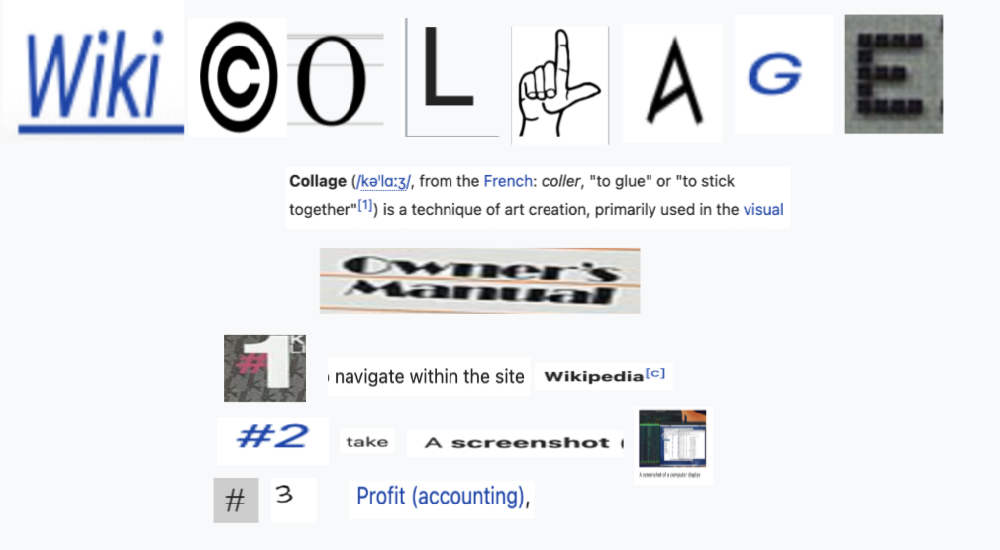

# Wiki Collage

An application to create a collage of Wikipedia screenshots with sources.

Originally made for [Wiki Game Jam 2025](https://wikigamejam.org/)

[Video Demo](https://www.youtube.com/watch?v=r1Gs001TN6E)



## How to Use

If you just want to download this, use the github release tab

Tips:

- auto-saving is currently kinda broken. manually save changes via `cmd+s` or else you will lose your progress on app exit
- hold "option" key and hover on objects to go into "source mode", to see the sources of screenshots

## Getting Started

### Prerequisites

- [Node.js](https://nodejs.org/) (version 16 or higher)
- [pnpm](https://pnpm.io/) package manager

### Installation

Install dependencies:

```bash
pnpm install
```

### Development

Start the application in development mode:

```bash
pnpm start
```

### Building

Package the application:

```bash
pnpm package
```

Create distributable packages:

```bash
pnpm make
```

## Architecture

- **Frontend**: [HyperApp](https://github.com/jorgebucaran/hyperapp)
- **Desktop**: Electron
- **Build System**: Electron Forge

## License

MIT

## Author

Justin Liang (justinliang1020@gmail.com)
